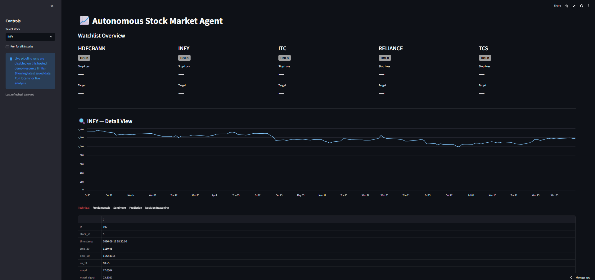
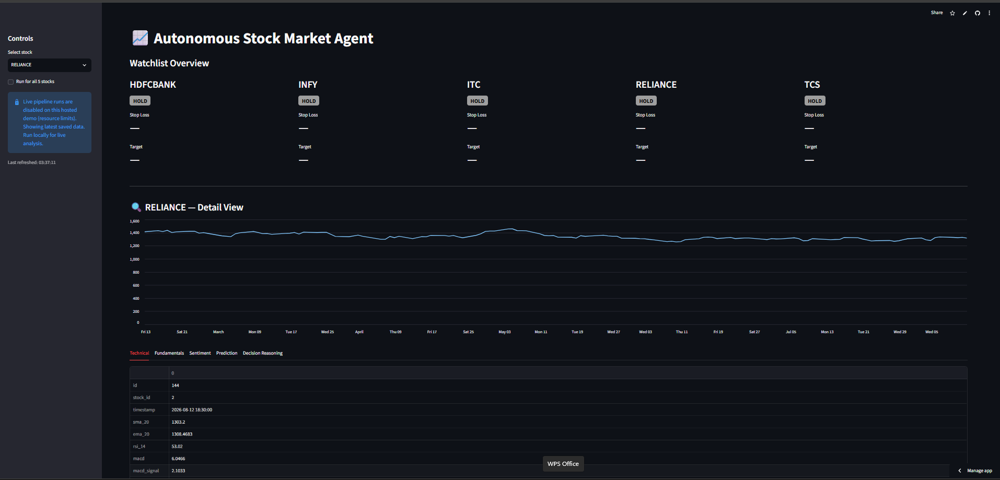

# 📈 Autonomous Stock Market Agent

A fully autonomous, multi-agent AI system that analyzes Indian stocks (NSE/BSE) and produces
buy/sell/hold decisions with reasoning, stop-loss/target levels, a live dashboard, and Telegram
alerts — built entirely on free tools and APIs.

**🔗 Live demo:** [autonomous-aistock-agent.streamlit.app](https://autonomous-aistock-agent-ppvzbvw7osfbqr2x8y4q3n.streamlit.app)
*(hosted demo runs in view-only mode — see [Deployment](#deployment) below)*

---

## What it does

Six specialized AI agents independently analyze a stock — technicals, news, sentiment,
fundamentals, and a price prediction model — then a Decision Agent combines their signals
using a weighted risk-rule engine to produce a final verdict (`STRONG_BUY` / `BUY` / `HOLD` /
`SELL` / `STRONG_SELL`) with an ATR-based stop-loss and target price. Every non-HOLD decision
triggers a Telegram alert and a plain-English explanation from a CrewAI reasoning agent.

## Architecture

Technical ─┐

News ──────┼─→ Sentiment ─┐

Fundamental┤              ├─→ Decision Agent ─→ Orchestrator ─┬─→ Dashboard

Prediction ┘              ┘                                   └─→ Telegram Alert

## Agents

| Agent                  | What it does                                                                 |
| ---------------------- | ---------------------------------------------------------------------------- |
| **Technical**    | SMA, EMA, RSI, MACD, Bollinger Bands, ATR via`yfinance` + `ta`           |
| **News**         | Pulls recent headlines via Google News RSS (no API key)                      |
| **Sentiment**    | Scores headlines with FinBERT, aggregates to an overall sentiment score      |
| **Fundamental**  | P/E, EPS, ROE, debt-to-equity, dividend yield, etc. via`yfinance`          |
| **Prediction**   | Random Forest next-day direction prediction, walk-forward backtested         |
| **Decision**     | Weighted rule engine combining all signals into a final verdict + risk flags |
| **Orchestrator** | Runs the full pipeline per stock, wires in alerts and explanations           |

## Tech Stack

- **Agent framework:** CrewAI + Google Gemini 2.5 Flash (free tier)
- **Data:** yfinance, Google News RSS, FinBERT (`transformers`/`torch`), scikit-learn
- **Database:** PostgreSQL (local dev) / Neon (hosted, for the live demo)
- **Dashboard:** Streamlit
- **Alerts:** Telegram Bot API
- **Cost:** $0 — no paid APIs, no paid hosting

## An honest limitation, by design

The Prediction Agent's Random Forest model was walk-forward backtested across 280 predictions
on 5 stocks: **directional accuracy came out to exactly 0.500 — a coin flip.** Rather than
tune this away, the Decision Agent's weighting reflects it directly — Prediction is weighted
lowest (0.15) of the four signals, and further discounted when its own confidence is weak.
This is a real, structural finding about short-horizon technical-only prediction, not a bug —
and the system is built to be honest about it rather than oversell it.

## Screenshots




## Running Locally

```bash
git clone https://github.com/Ashok1921/Autonomous-aistock-agent.git
cd Autonomous-aistock-agent
python -m venv venv
venv\Scripts\activate          # Windows
pip install -r requirements-full.txt   # see note below
```

Set up a local PostgreSQL database, run the schema migration, add your `.env` (see
`.env.example`), then:

```bash
python -m agents.orchestrator          # run the full pipeline for the default watchlist
python -m streamlit run dashboard.py   # launch the dashboard
```

> **Note:** `requirements.txt` in this repo is intentionally minimal — it's what the hosted
> demo needs (dashboard-only, no live pipeline runs). For full local functionality including
> live pipeline runs (FinBERT, CrewAI, scikit-learn), install the additional packages listed
> in the agent files, or generate a full list via `pip freeze` from a working local setup.

## Deployment

The public demo runs on **Streamlit Community Cloud** reading from a **Neon** (hosted
Postgres) database, in a resource-conscious "view-only" mode:

- `DEPLOY_MODE=true` hides the "Run Pipeline Now" button and lazily skips importing
  `torch`/`transformers`/`crewai` entirely, keeping the free-tier deploy light and fast
- The dashboard shows the latest saved decisions/data — run the pipeline locally for
  live, on-demand analysis

## Project Log

See [`PROGRESS.md`](PROGRESS.md) for the full build log — every agent, every bug hit and
fixed, and every verification step, in detail.

## Disclaimer

This is a portfolio/learning project, not investment advice. Verdicts, stop-loss, and target
prices are generated by an experimental rule-based system and should not be used for real
trading decisions.
